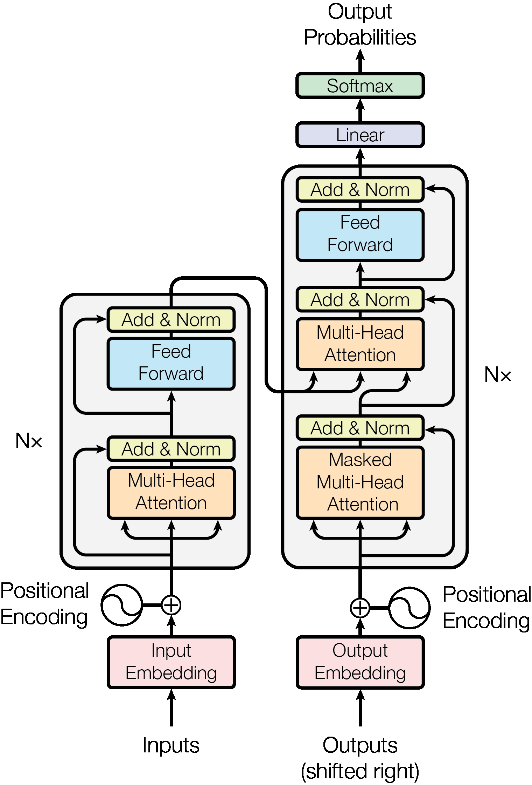

# Sequence Models - Deeplearning.ai

This repo contains the code and lecture notes for the 3rd course from the deeplearning specialization by deeplearning.ai

The course covers sequence models from RNNs to Transformers. Including wordembeddings, recurrent architecture variants such as GRUs and LSTMs and the Attention mechanism.

> Note that some notebooks might not work properly because either _data_ or _models_ are not present in the repo. This folders weren't included in the repo to save space, and also because the main idea was to keep the notebooks to keep the ideas and the "howto" of the implementation in python.  

